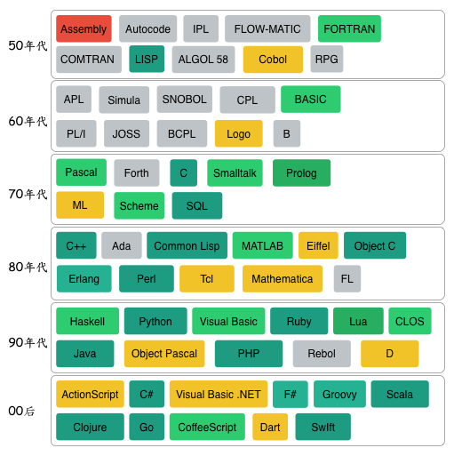
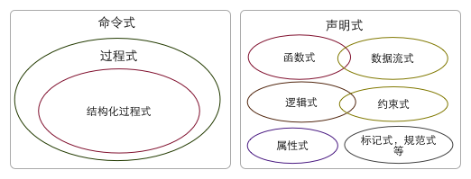

编程语言漫谈
==========

## 编程语言历史

从汇编语言发展到现在，编程语言层出不穷，具体数目已经无法考证，比较流行的至少超过200种以上，上图列出了比较流行编程语言或者是对编程语言产生过重大影响的编程语言。
* 1951 – Regional Assembly Language
* 1952 – Autocode
* 1954 – IPL (LISP语言的祖先)
* 1955 – FLOW-MATIC (COBOL语言的祖先)
* 1957 – FORTRAN (第一个编译型语言)
* 1957 – COMTRAN (COBOL语言的祖先)
* 1958 – LISP
* 1958 – ALGOL 58
* 1959 – FACT (COBOL语言的祖先)
* 1959 – COBOL
* 1959 – RPG
* 1962 – APL
* 1962 – Simula
* 1962 – SNOBOL
* 1963 – CPL (C语言的祖先)
* 1964 – BASIC
* 1964 – PL/I
* 1966 – JOSS
* 1967 – BCPL (C语言的祖先)
* 1968 – Logo
* 1969 – B (C语言的祖先)
* 1970 – Pascal
* 1970 – Forth
* 1972 – C
* 1972 – Smalltalk
* 1972 – Prolog
* 1973 – ML
* 1975 – Scheme
* 1978 – SQL
* 1980 – C++ (既有类的C语言，更名于1983年7月)
* 1983 – Ada
* 1984 – Common Lisp
* 1984 – MATLAB
* 1985 – Eiffel
* 1986 – Objective-C
* 1986 – Erlang
* 1987 – Perl
* 1988 – Tcl
* 1988 – Mathematica
* 1989 – FL
* 1990 – Haskell
* 1991 – Python
* 1991 – Visual Basic
* 1993 – Ruby
* 1993 – Lua
* 1994 – CLOS (ANSI Common Lisp的一部分)
* 1995 – Java
* 1995 – Delphi (Object Pascal)
* 1995 – JavaScript
* 1995 – PHP
* 1996 – WebDNA
* 1997 – Rebol
* 1999 – D
* 2000 – ActionScript
* 2001 – C#
* 2001 – Visual Basic .NET
* 2002 – F#
* 2003 – Groovy
* 2003 – Scala
* 2007 – Clojure
* 2009 – Go
* 2010 - CoffeeScript
* 2011 – Dart
* 2014 - Swift

## 编程语言分类
### 强类型 vs 弱类型
弱/强类型指的是语言类型系统的类型检查的严格程度。大部分编程语言都属于强类型语言，弱类型语言的典型代表有C，JavaScript。

### 静态语言 vs 动态语言
静态/动态语言指的是变量与类型的绑定方法，静态类型指的是编译器在compile time执行类型检查，动态类型指的是编译器（虚拟机）在runtime执行类型检查。简单地说，在声明了一个变量之后，不能改变它的类型的语言，是静态语言；能够随时改变它的类型的语言，是动态语言。因为动态语言的特性，一般需要运行时虚拟机支持。

### 脚本语言 vs 通用的编程语言

## 编程范式

### 命令式
命令“机器”如何去做事情(how)，这样不管你想要的是什么(what)，它都会按照你的命令实现。

### 声明式
告诉“机器”你想要的是什么(what)，让机器想出如何去做(how)。

## 编程语言特性

### 垃圾回收

### 类型推断
对任何语言，具体是哪些地方有必要加上类型标记呢？其实有一个很简单的方法来判断：观察信息进出函数的“接口”，把这些接口都做上标记。直观一点说，函数就像是一个电路模块，只要我们知道输入和输出是什么，那么中间的导线里面是什么，我们其实都可以推出来。类型推导的过程，就像是模拟这个电路的运行。这里函数的输入就是参数，输出就是返回值，所以基本上把这两者加上类型标记，里面的局部变量的类型都可以推出来。另外需要注意的是，如果函数使用了全局变量，那么全局变量就是函数的一个“隐性”的输入，所以如果程序有全局变量，都需要加上类型标记。

### Structural subtyping vs Nominal Subtyping
Go语言中，只要有Interface中定义的方法，就算实现了该接口，不声不响地把静态语言的Duck Type给做了！
Swift尽管用的是Nominal Subtyping，但是swift中有extension，可以在类型定义后，再声明class实现protocol，虽然繁琐点，但依然不是灵活性。
动态语言如Ruby，Python，JavaScript，一般不需要考虑这些，因为他们天然就支持duck type。

### 闭包
在计算机科学中，闭包（Closure）是词法闭包（Lexical Closure）的简称，是引用了自由变量的表达式（通常是函数）。这些被引用的自由变量将和这个函数一同存在，即使已经离开了创造它的环境也不例外。
词法作用域(lexical scope)等同于静态作用域(static scope)。所谓的词法作用域其实是指作用域在词法解析阶段既确定了，不会改变。

闭包的数据结构可以定义为，包含一个函数定义 f 和它定义时所在的环境
(struct Closure (f env))
1. 全局函数是一个有名字但不会捕获任何值的闭包。
2. 嵌套函数是一个有名字并可以捕获其封闭函数域内值得闭包。
3. Lambda(闭包表达式)是一个利用轻量级语法所写的可以捕获其上下文中变量值的匿名闭包。

闭包 vs 函数指针

### Mixin
Ruby 优雅的Mixin方案

~~~ruby
module Foo
    def foo
        "foo"
    end
end
module Bar
    def bar
        "bar"
    end
end
class Demo
    include Foo, Bar
end
~~~

Python，C++允许多重继承。
Java8 也支持接口方法有默认实现（感觉怪怪的，不过好歹也是一种进步）

### Open Class

* Ruby

~~~ruby
class Numeric
    def square
        self * self
    end
end
3.square
~~~

* Python

~~~python
class int(int):
    def square(self):
        return self * self

int(3).square()
~~~

* Swift

~~~swift
extension Int {
    func square(){
        self * self
    }
}
3.square()
~~~

* C#

~~~c#
namespace ExtensionMethods {
    public static class MyExtensions {
        public static int square(this Int32 value) {
            return value * value;
        }
    }
}
using ExtensionMethods;
3.square
~~~

### Optional
optional 作为一个非常关键的特性加入到了Swift当中，经过Guava的实践，Optional也被正式引入了Java8，配合上Stream API也可以摆脱恼人的不断的判空逻辑。

~~~swift
puts person.contact?.address?.city!
~~~
Ruby默认也不支持Optional，但是要加入该功能也非常简单。

~~~ruby
class Optional
  def initialize(value)
    @value =  value
  end

  def method_missing(method, *args, &block)
    if @value != nil
      @value.send method, *args, &block
    else
      if method.to_s =~ /^.+!$/
        nil
      else
        Optional.new(nil)
      end
    end
  end
end

require './optional'

class Module

  def define_attr(*attrs)
    attr_accessor *attrs
    attrs.each{|attr| define_attr_internal attr }
  end

  private
    def define_attr_internal(attr)
      if attr.to_s =~ /^[\w_]+$/
        class_eval do

          define_method "#{attr}=" do |value|
            instance_variable_set("@#{attr}", value)
          end

          define_method "#{attr}" do
            instance_variable_get("@#{attr}")
          end

          define_method "#{attr}?" do
            Optional.new(self.send attr.to_sym)
          end

          define_method "#{attr}!" do
            val = self.send attr.to_sym
            if val
              val
            else
              raise Error.new("#{attr} is not found")
            end
          end

        end
      else
        puts "Invalid attr name #{attr}"
      end
    end

end
class Person
  define_attr :contact
end

class Contact
  define_attr :address
end

class Address
  define_attr :province, :city, :street
end

addr = Address.new
addr.province = 'Guangdong'
addr.city = 'Shenzhen'
addr.street = '699'

contact = Contact.new
contact.address = addr

person = Person.new
person.contact = contact

person2 = Person.new

puts person2.contact?.address?.city!
puts person.contact?.address?.city!
~~~

## DSL与元编程
### 元编程
#### C++ template 生成代码
静态展开

#### 万能的eval
Python, JavaScript都只含有全局的eval，只能解析字符串，尽管也可以完成想要的功能，确是相当不便和不安全。
Ruby 中不仅有传统的eval，还有class_eval，instance_eval，不仅可以解析字符串，还允许执行代码块。
上例中的Ruby Optional的例子就用到了class_eval，把eval限制在了类的内部。

#### 强大的宏

CLOS（Common Lisp面向对象系统）就是直接用宏编写而成。

Ruby中的宏，功能相比Lisp中宏的用法当然要弱了许多，但是依然可以满足大部分的元编程需求。熟悉ruby的同学肯定都很熟悉attr_accessor，它可以很方便地帮类成员生成set和get方法。

~~~ruby
class Module
  def attr_accessor(*syms)
    syms.each do|sym|
      class_eval <<-RUBY_EVAL, __FILE__, __LINE__ + 1
        def #{sym}
          @#{sym}
        end
        def #{sym}=(val)
          @#{sym} = val
        end
      RUBY_EVAL
    end
  end
end
~~~

#### 动态语言的 method_missing
~~~ruby
class Hasie
  def initialize(hash)
    @hash = hash
  end

  def method_missing(method, *args, &block)
    if @hash.include?(method)
      self.class.__send__ :define_method, method do|*args, &block|
        @hash[method]
      end
      self.__send__(method, *args, &block)
    else
      super
    end
  end

end

hash = {:a => 1, :b => 2}
h = Hasie.new(hash)
puts h.a()
puts h.b()
~~~

python __getattr__  （Python中一切对象上的一切都是属性，很灵活地添加，删除以及重定义，可以玩出各种Trick，不过在代码即数据和Ruby及Lisp还差很远。）

~~~python
class Hasie(object):
    def __init__(self, _hash):
        self.hash = _hash

    def __getattr__(self, name):
        if name in self.hash:
            func = lambda: self.hash[name]
            self.__setattr__(name, func)
            return func
        else:
            raise AttributeError(name)

hash = {'a': 1, 'b': 2}
h = Hasie(hash)
print(h.a())
print(h.b())
~~~

### 外部DSL
1. awk是一个很典型外部DSL例子，其语法为 awk 'pattern {action}'，其做的事情非常简单，扫描所有的行，一旦发现符合pattern的行，则执行action。

以下例子用于找出所有sugou.1688.com所有来源链接。

~~~sh
less cookie_log | awk '/sugou\.1688\.com/{print $13;}' | sort | uniq
~~~

2. make 一个更典型的外部DSL例子

~~~makefile
hello:hello.o
    gcc -o hello hello.o
hello.o:hello.c
    gcc -c hello.c
clean:
    rm -f *.o hello
~~~

3. 由于Java语言的特性，Java中使用的DSL一般都用XML来描述，例如ANT和Maven，下面看下Maven Project管理例子。

~~~xml
<?xml version="1.0" encoding="UTF-8"?>
<project xmlns="http://maven.apache.org/POM/4.0.0"
         xmlns:xsi="http://www.w3.org/2001/XMLSchema-instance"
         xsi:schemaLocation="http://maven.apache.org/POM/4.0.0 http://maven.apache.org/xsd/maven-4.0.0.xsd">
    <groupId>com.prometheus.shared</groupId>
    <modelVersion>4.0.0</modelVersion>
    <artifactId>kindle</artifactId>
    <version>1.0-SNAPSHOT</version>

    <dependencies>
        <dependency>
            <groupId>com.google.guava</groupId>
            <artifactId>guava</artifactId>
        </dependency>

        <dependency>
            <groupId>org.ow2.asm</groupId>
            <artifactId>asm</artifactId>
            <version>4.2</version>
        </dependency>
    </dependencies>
</project>
~~~

### 内部DSL
1. Clojure Project管理

~~~clojure
(defproject hello-world "0.1.0-SNAPSHOT"
  :description "FIXME: write description"
  :url "http://example.com/FIXME"
  :license {:name "Eclipse Public License"
            :url "http://www.eclipse.org/legal/epl-v10.html"}
  :dependencies [[org.clojure/clojure "1.6.0"]
                 [ring/ring-core "1.3.0"]
                 [ring/ring-jetty-adapter "1.3.0"]])
~~~

2. Ruby Gem file
~~~ruby
source 'https://ruby.taobao.org/'

gem 'rails', '4.1.1'
gem 'mysql2'
gem 'sass-rails', '~> 4.0.3'
gem 'uglifier', '>= 1.3.0'
gem 'coffee-rails', '~> 4.0.0'
gem 'jquery-rails'

group :development do
  gem 'pry'
  gem 'better_errors'
  gem 'binding_of_caller'
end

group :development, :test do
  gem 'spring-commands-rspec'
  gem 'rspec-rails'
  gem 'factory_girl_rails'
  gem 'guard-rspec'
  gem 'rb-fsevent'
end

group :test do
  gem 'faker'
  gem 'capybara'
  gem 'launchy'
  gem 'database_cleaner'
end
~~~

## 编程语言趋势猜想
### 编写新语言更加简单
程序语言设计者将不需要关注具体的目标机器，也即不需要关心编译后端及代码优化这一块，目标代码将会是某一成熟的虚拟机字节码或者其他语言源文件。
* ClojureScript，CoffeeScript 生成 JavaScript源码
* Scala，Clojure，Groovy 生成 Java字节码
* Swift，Object-C 生成 LLVM字节码

### 语言生态
多语言协同

### 程序员分工更明晰
以往，有经验的程序员设计库和框架，普通程序员开发上层应用，以后的趋势可能是这样的，资深的程序员设计DSL语言的实现，普通的开发人员使用该DSL构建应用。

