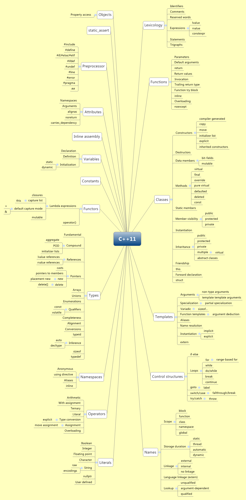
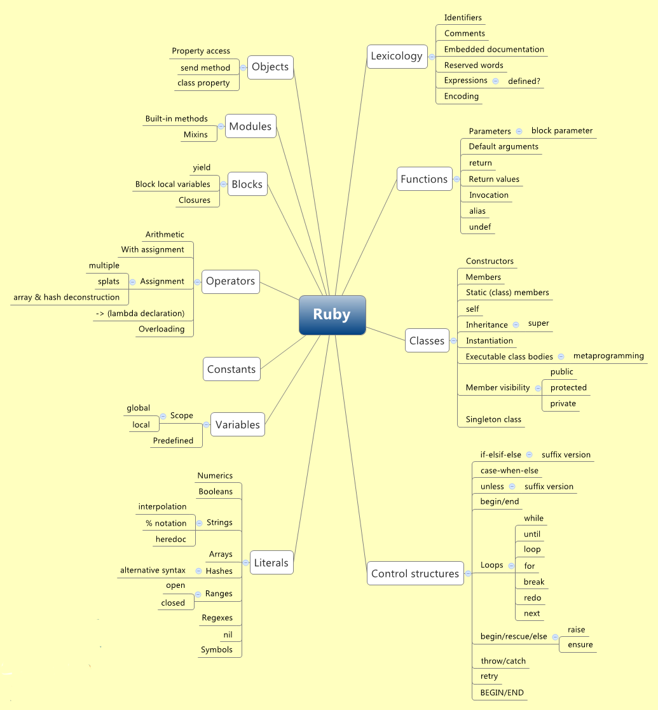
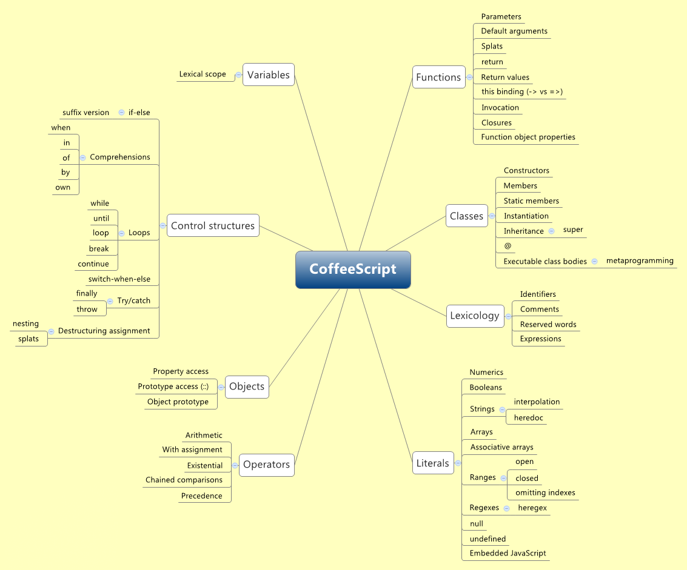

编程语言特性比较
=============

## 语言比较
1. [Perl vs PHP vs Python vs Ruby](http://pan.baidu.com/s/1i3KH6lR)
2. [Lisp方言比较](http://hyperpolyglot.org/lisp)

## 语言特性
### C++ Feature

### Ruby Feature

### Coffeescript Feature

